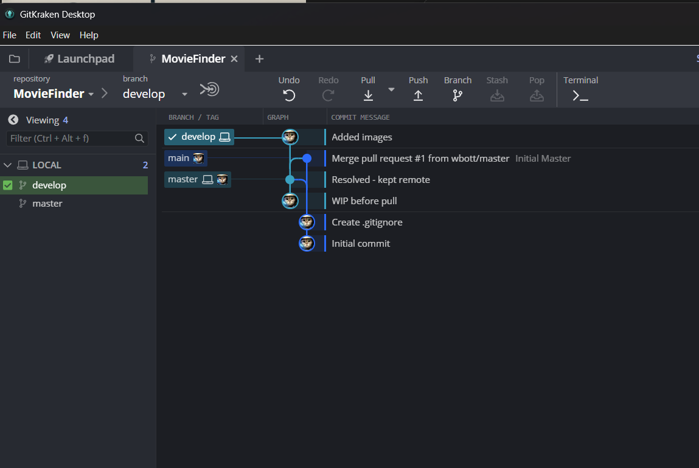

# rag-movie-rec

# 🎬 Chat-based Movie Search System

**Ask about movies by genre, actors, plot summaries, or reviews — just like chatting with a friend.**

---

## ✨ Features

- **💬 Conversational Movie Search**  
  Ask natural questions about movies by **genre**, **cast**, **plot**, or **reviews**.

- **🎯 Smart Recommendations**  
  Get personalized suggestions based on your interests.

- **⚡ Instant Movie Info**  
  Instantly see **ratings**, **summaries**, and **reviews**—no more manual searches.

---

## 🧠 Project Outline

1. 📂 **Load** a cleaned, aggregated movie dataset  
2. ✍️ **Generate simple descriptions** for each movie  
3. 🔄 **Chunk** the data into blocks with slight overlap  
4. 🧬 **Create embeddings** from each data chunk  
5. 🗃️ **Build FAISS index** (Facebook AI Similarity Search)  
6. 🔍 **Query the FAISS index** to test similarity results  
7. 🤖 **Setup LLM (ChatGPT)** with a custom **prompt template**  
8. 🔗 **Create a RAG pipeline** (Retrieval-Augmented Generation) using the vector store, template, and LLM  
9. 🧪 **Connect the RAG chain** to a **Gradio UI** for live testing  
10. 🧰 **Add tools & agents**, and define an **orchestrator chain**  
11. 🎥 **Run full queries** through the orchestrator to handle complex movie searches

---

_Ready to roll? Let’s build a smarter way to search for movies._ 🍿
