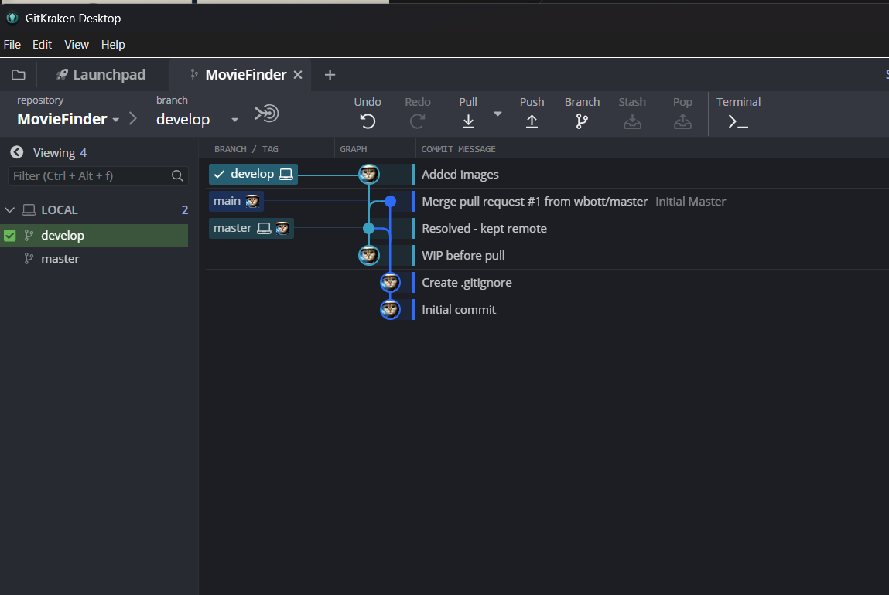
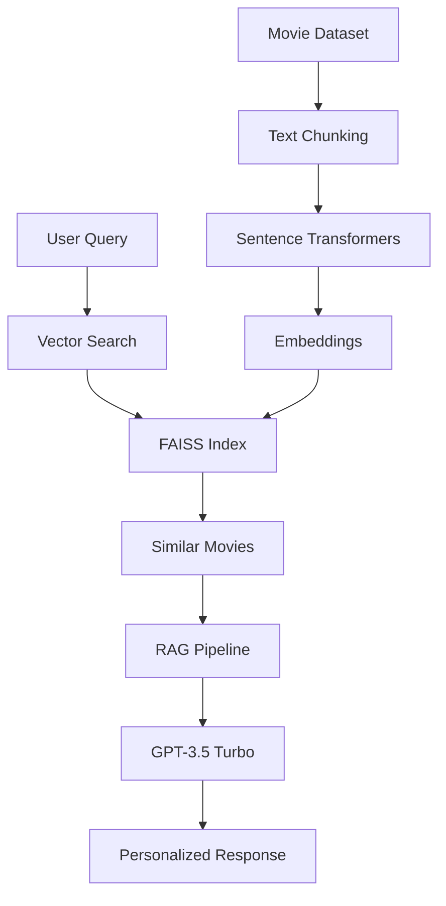

# 🎬 Movie Recommendation System

[](https://python.org)
[](https://openai.com)
[](https://langchain.com)
[](https://github.com/facebookresearch/faiss)
[](https://gradio.app)
[](https://github.com)



**Ask about movies by genre, actors, plot summaries, or reviews — just like chatting with a friend.**

---

## ✨ Features

- **💬 Conversational Movie Search**  
  Ask natural questions about movies by **genre**, **cast**, **plot**, or **reviews**.

- **🎯 Smart Recommendations**  
  Get personalized suggestions based on your interests using state-of-the-art AI.

- **⚡ Instant Movie Info**  
  Instantly see **ratings**, **summaries**, and **reviews**—no more manual searches.

- **🤖 Multi-Agent Architecture**  
  Orchestrated agents for retrieval, recommendations, and external data integration.

- **🔍 Vector-Powered Search**  
  FAISS-based similarity search with OpenAI embeddings (no heavy downloads required).

- **⚡ Lightning Fast Setup**  
  No CUDA libraries or large ML models - just install and go!

---

## 🎯 Why This Project?

**Traditional movie search is broken.** You know the feeling:
- 🤔 *"I want something like Inception but not sci-fi"*
- 😤 *"Show me action movies but make them smart"*  
- 🎭 *"Find me movies with that actor from that thing"*

**This system gets it.** Instead of keyword matching, it understands **context**, **meaning**, and **relationships** between movies. Ask naturally, get perfect results.

### 🧠 The Secret Sauce
1. **RAG Architecture** - Combines retrieval with generation for nuanced responses
2. **Vector Similarity** - Finds movies based on meaning, not just keywords  
3. **Multi-Agent System** - Specialized AI agents work together for complex queries
4. **No Setup Hell** - Lightweight, fast, and CUDA-free

---

## 🛠️ Technologies & Tools

| Technology | Purpose | Version |
|------------|---------|---------|
| **🐍 Python** | Core Language | 3.8+ |
| **🤖 OpenAI GPT-3.5** | Language Generation | Latest |
| **🦜 LangChain** | LLM Framework | 0.3+ |
| **🔍 FAISS** | Vector Similarity Search | CPU Version (No CUDA) |
| **🔗 OpenAI Embeddings** | Text Embeddings | text-embedding-3-small |
| **🎨 Gradio** | Web UI Framework | 5.0+ |
| **📊 Pandas** | Data Processing | Latest |
| **📓 Jupyter** | Interactive Development | Latest |

---

## 🚀 Quick Start

**Get up and running in under 2 minutes!**

### Option 1: Python Application (Recommended)

```bash
# 1. Clone the repository
git clone <repository-url>
cd rag-movie-rec

# 2. Create virtual environment (recommended)
python3 -m venv movie-env
source movie-env/bin/activate  # On Windows: movie-env\Scripts\activate

# 3. Install dependencies (lightweight, no CUDA!)
pip install -r requirements.txt

# 4. Set up your OpenAI API key
export OPENAI_API_KEY="your-openai-api-key"

# 5. Build the vector store
python main.py --mode build

# 6. Launch the web UI
python main.py --mode ui
```

**💡 Pro tip:** Get your OpenAI API key at [platform.openai.com/api-keys](https://platform.openai.com/api-keys)

### Option 2: Jupyter Notebook (Step-by-step)

```bash
# 1. Install dependencies
pip install -r requirements.txt

# 2. Launch Jupyter
jupyter notebook

# 3. Open and run notebooks/MovieFinder_Main.ipynb
```

---

## 🧠 How It Works

### Architecture Overview


```mermaid
graph TB
    A[User Query] --> B[Vector Search]
    B --> C[FAISS Index]
    C --> D[Similar Movies]
    D --> E[RAG Pipeline]
    E --> F[GPT-3.5 Turbo]
    F --> G[Personalized Response]
    
    H[Movie Dataset] --> I[Text Chunking]
    I --> J[Sentence Transformers]
    J --> K[Embeddings]
    K --> C
```

### The Process

1. **📂 Data Ingestion**  
   Load and clean IMDb movie dataset with ratings, cast, genres, and descriptions.

2. **✍️ Description Generation**  
   Create natural language descriptions for each movie combining all metadata.

3. **🔄 Text Chunking**  
   Split descriptions into overlapping chunks for better retrieval granularity.

4. **🧬 Embedding Creation**  
   Convert text chunks to high-dimensional vectors using Sentence Transformers.

5. **🗃️ Vector Store Building**  
   Build FAISS index for lightning-fast similarity search across 7,000+ chunks.

6. **🔍 Query Processing**  
   Convert user queries to embeddings and find most similar movie content.

7. **🤖 AI Generation**  
   Use retrieved context with GPT-3.5-turbo to generate personalized responses.

8. **🎨 User Interface**  
   Present results through intuitive Gradio web interface or CLI.

---

## 📋 Usage Examples

### Web Interface
Launch the web UI and try these queries:
- *"Recommend documentaries about famous people"*
- *"What are some good action movies from the 2000s?"*
- *"Movies similar to The Lord of the Rings"*
- *"Comedy movies with high IMDb ratings"*

### Command Line
```bash
# Interactive CLI mode
python main.py --mode cli

# Build/rebuild vector store
python main.py --mode build
```

### Python API
```python
from src.movie_recommender.main import MovieRecommenderApp

app = MovieRecommenderApp()
app.setup_agents()

result = app.orchestrator.process_query("Sci-fi movies with robots")
print(result)
```

---

## 🏗️ Project Structure

```
rag-movie-rec/
├── src/movie_recommender/          # Core application modules
│   ├── __init__.py
│   ├── config.py                   # Configuration management
│   ├── data_processor.py           # Data processing utilities
│   ├── vector_store.py             # FAISS vector operations
│   ├── agents.py                   # Multi-agent orchestration
│   ├── rag_pipeline.py             # RAG implementation
│   ├── ui.py                       # Gradio interface
│   └── main.py                     # Application entry point
├── notebooks/                      # Jupyter development notebooks
│   ├── MovieFinder_Main.ipynb      # Primary development notebook
│   └── MovieFinder_Supplemental.ipynb
├── scripts/                        # Data preparation scripts
│   ├── SetupData.py                # Dataset downloading & merging
│   ├── format_movie.py              # Cast column formatting
│   └── ...
├── tests/                          # Test suite
├── data/                           # Generated data files
├── main.py                         # Application launcher
├── requirements.txt                # Python dependencies
└── README.md                       # This file
```

---

## 🔧 Development

### Setting Up Development Environment

```bash
# Install development dependencies
pip install -r requirements.txt

# Install in editable mode
pip install -e .

# Run tests
python -m pytest tests/

# Format code
black src/ tests/

# Lint code
flake8 src/ tests/
```

### Data Pipeline

```bash
# 1. Download and prepare dataset (requires Kaggle API)
python scripts/SetupData.py

# 2. Format cast columns
python scripts/format_movie.py

# 3. Build vector store
python main.py --mode build
```

---

## 🧪 Testing

```bash
# Run all tests
python -m pytest tests/ -v

# Run specific test categories
python -m pytest tests/test_vector_store.py -v
python -m pytest tests/test_agents.py -v

# Run with coverage
python -m pytest tests/ --cov=src/movie_recommender --cov-report=html
```

---

## 📝 Configuration

### Environment Variables
```bash
# Required
export OPENAI_API_KEY="your-openai-api-key"

# Optional
export OMDB_API_KEY="your-omdb-api-key"
```

### Customization
Edit `src/movie_recommender/config.py` to customize:
- Model parameters (temperature, max tokens)
- Chunk sizes and overlap
- Vector store settings
- UI configuration

---

## 📊 Performance

- **Dataset**: 3,653 movies with 7,225 text chunks
- **Vector Search**: Sub-second similarity queries
- **Memory Usage**: ~100MB total installation (no heavy ML libraries)
- **Embedding Model**: 1,536-dimensional vectors (OpenAI text-embedding-3-small)
- **Setup Time**: Under 2 minutes vs 30+ minutes with local models

---

## 🤝 Contributing

1. Fork the repository
2. Create a feature branch (`git checkout -b feature/amazing-feature`)
3. Commit your changes (`git commit -m 'Add amazing feature'`)
4. Push to the branch (`git push origin feature/amazing-feature`)
5. Open a Pull Request

---

## 📄 License

This project is licensed under the MIT License - see the LICENSE file for details.

---

## 🙏 Acknowledgments

- **OpenAI** for GPT-3.5-turbo language model
- **Meta AI** for FAISS vector search library
- **Hugging Face** for Sentence Transformers
- **LangChain** for LLM orchestration framework
- **Gradio** for the beautiful web interface
- **IMDb** for the movie dataset

---

_Ready to roll? Let's build a smarter way to search for movies._ 🍿